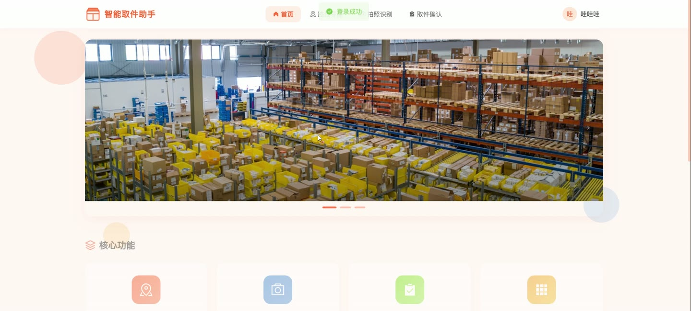
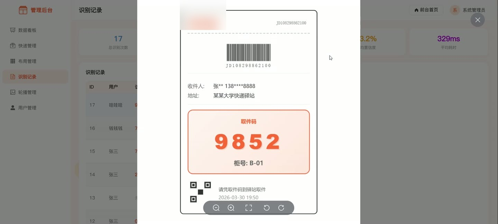
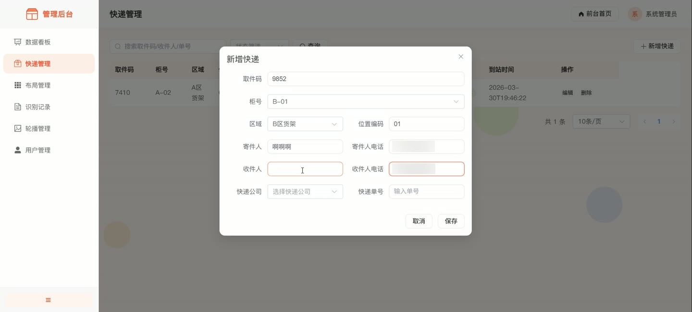
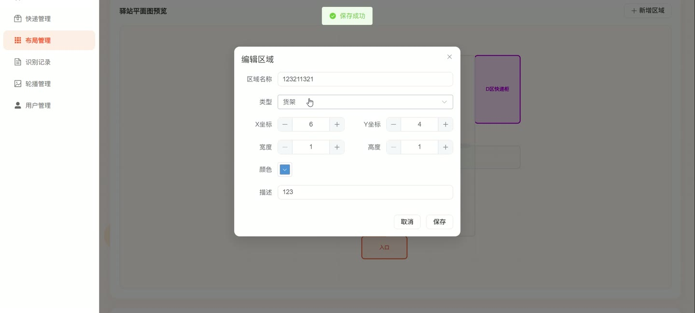
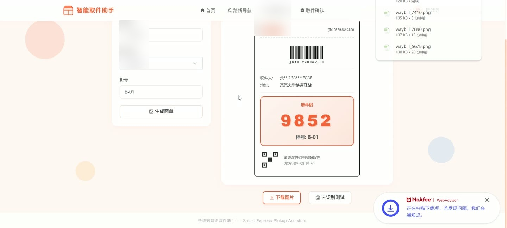

# (附文档)Python+Flask+Vue3 快递站智能取件助手

**技术栈**：Python、Flask、Vue3、MySQL

### 系统简介

本系统是一套面向快递驿站场景的智能取件助手，采用前后端分离架构，后端基于 Python Flask 提供 RESTful API，前端基于 Vue3 + Element Plus 构建单页应用，数据存储使用 MySQL。系统分为普通用户端与管理员端两类角色，普通用户可完成取件码查询、路线导航、拍照识别与取件确认，管理员可对快递、驿站布局、轮播图、识别记录与用户进行统一管理。
 
### 核心功能
 
### 普通用户端

 
- 用户注册：填写用户名、密码、确认密码、真实姓名与手机号，前端校验用户名长度 3-20 位、密码不少于 6 位、两次密码一致。 
- 用户登录：输入用户名与密码登录，登录成功后按角色跳转，管理员进入数据看板，普通用户进入前台首页。 
- 首页轮播展示：读取后台启用的轮播图，按排序展示标题与图片，无数据时展示默认主题横幅。 
- 快速查询：在首页输入取件码查询快递，展示取件码、快递公司、柜号、区域、位置、收件人与到站时间。 
- 路线导航：输入取件码后查询快递信息，并调用路线接口获取从入口到目标柜号的推荐路径。 
- 驿站平面图可视化：以 SVG 网格渲染布局区域，按坐标、宽高、颜色绘制货架、快递柜、入口与通道。 
- 路线绘制：在平面图上以虚线折线绘制推荐路线，标注起点入口与终点柜号，并以动画节点提示目标位置。 
- 拍照识别：上传快递面单图片，调用识别接口获取取件码结果、置信度与耗时。 
- 取件确认：根据快递 ID 确认取件，系统更新快递状态并记录取件信息。 
- 面单模板查看：提供面单模板页面，供用户对照取件码位置进行拍照识别。
 
### 管理员端

 
- 数据看板：展示快递总数、待取件、已取件、用户数、识别次数、识别成功率、今日取件与已过期数量。 
- 趋势图表：以折线图展示近 7 日取件趋势，以环形饼图展示各快递公司快递数量分布。 
- 快递管理：分页展示取件码、柜号、区域、位置、快递公司、单号、收件人、电话、状态与到站时间。 
- 快递检索：支持按取件码、收件人、单号关键字搜索，并按待取件、已取件、已过期状态筛选。 
- 快递维护：新增或编辑快递，录入取件码、柜号、区域、位置编码、寄件人、收件人、快递公司与单号。 
- 布局管理：以 SVG 平面图预览驿站区域，支持点击区域直接进入编辑弹窗。 
- 区域维护：新增或编辑区域名称、类型、X/Y 坐标、宽度、高度、颜色与描述。 
- 识别记录管理：分页查看识别用户、识别结果、置信度、成功状态、耗时、上传图片与识别时间。 
- 识别统计：展示总识别次数、成功次数、成功率、平均置信度与平均耗时。 
- 轮播图管理：以卡片网格展示轮播图，支持新增、编辑、删除、上传本地图片、设置跳转链接、排序与显示状态。 
- 用户管理：分页查看用户 ID、用户名、真实姓名、手机号、角色、状态与创建时间。 
- 用户维护：新增或编辑用户，设置角色为管理员或普通用户，切换启用与禁用状态，编辑时密码留空则不修改。
 
### 技术栈

 后端框架Python Flask 跨域与鉴权Flask-CORS、Token 鉴权、角色权限校验 后端路由Flask Blueprint 蓝图（auth/express/layout/recognition/pickup/banner/upload/dashboard/user） 前端框架Vue3 组合式 API 前端路由Vue Router（含 requiresAdmin 路由守卫） 状态管理Pinia（useUserStore 存储 token 与用户信息） UI 组件库Element Plus 图表库ECharts 构建工具Vite 数据库MySQL
 
### 交付内容

 
- 后端完整源码 
- 前端完整源码 
- 数据库初始化脚本 
- 万字文档

## 界面展示

---

## 获取完整源码 + 万字文档

本仓库为项目介绍页。**完整前后端源码、数据库初始化脚本、万字项目文档**，请加微信 `kangkangcode`，或访问 [codekk.top](http://codekk.top) 获取。

可作课程设计 / 毕业设计参考，支持远程部署调试。